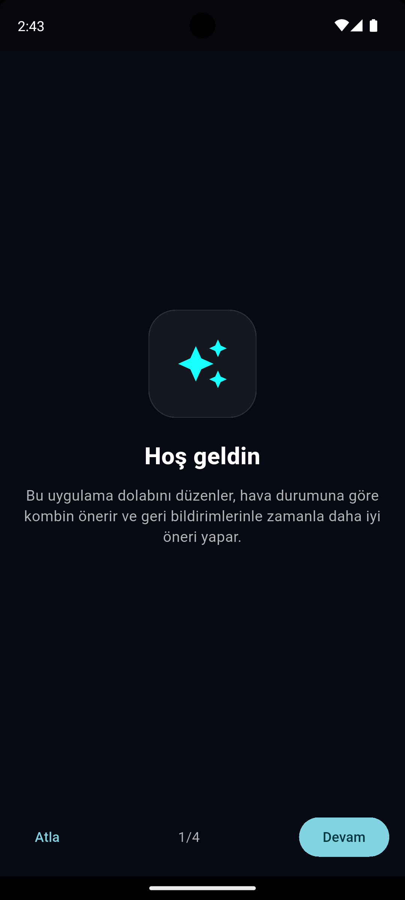
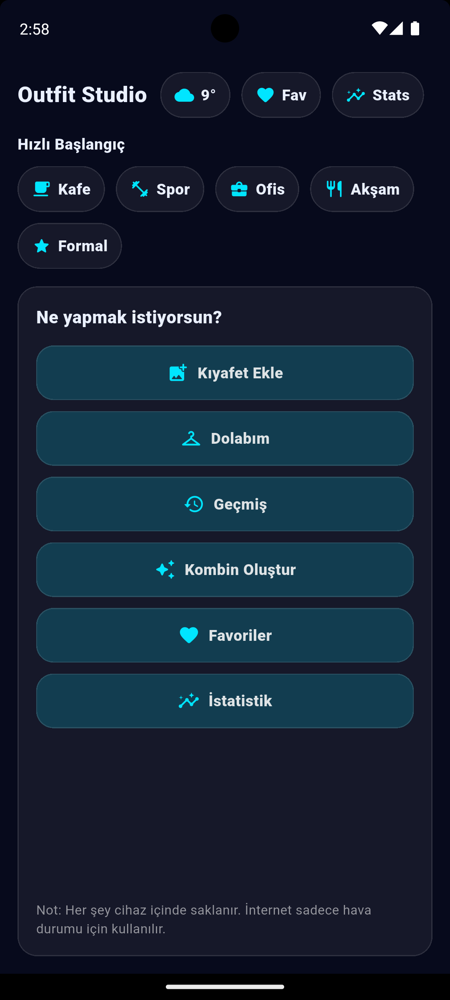
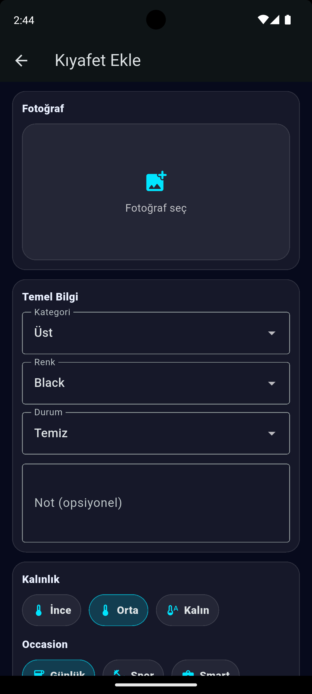
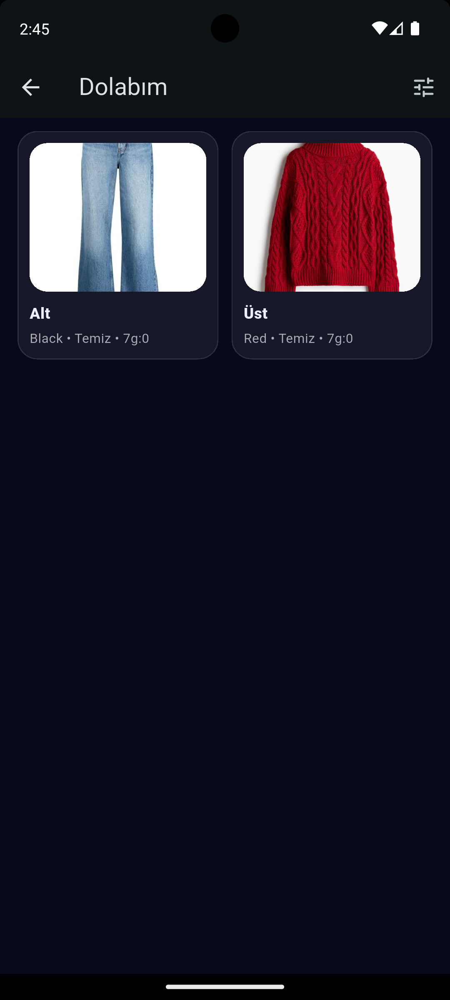
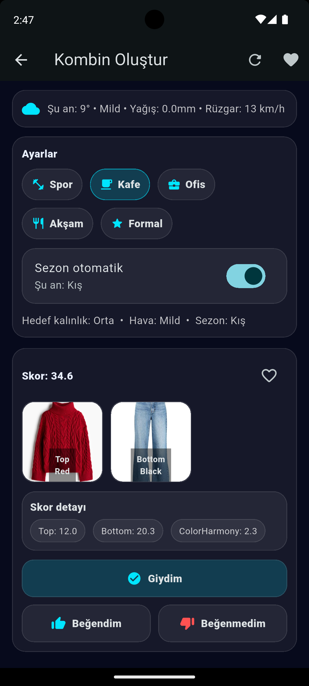
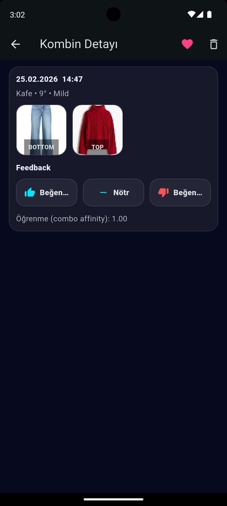
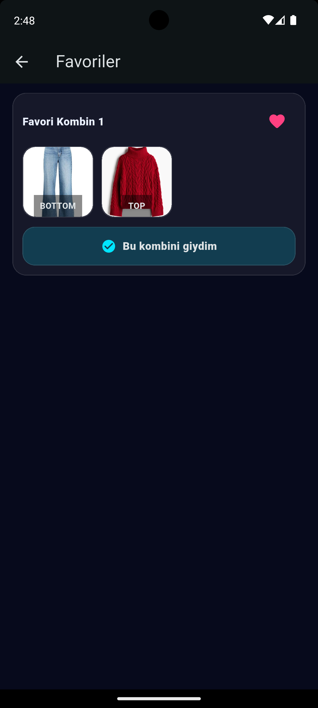
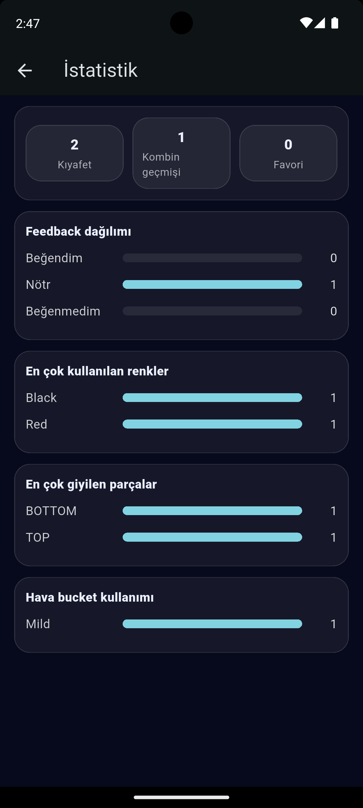

# Outfit Studio

A single-file Flutter app that helps you manage your wardrobe and get weather-aware outfit suggestions. It also learns from your “Wore it” and feedback actions over time.

> This repository contains a **single `lib/main.dart`** implementation.

---

## Table of Contents (EN)

- Overview
- Features
- Screenshots
- How It Works (User Guide)
- Scoring & Learning Logic (How the score is produced)
- Laundry States (Clean / Dirty / In Laundry)
- Data & Storage
- Tech Stack
- Setup & Run
- Build APK (Android)
- Notes & Troubleshooting
- Roadmap

---

## Overview

Outfit Studio is a practical “digital closet + outfit engine”:

- Save clothing items with photos and metadata (category, color, warmth, occasion, season, laundry state).
- Fetch local weather (Open‑Meteo) and generate outfit suggestions.
- Track your outfit history and avoid accidental duplicates.
- Mark outfits as favorite, and give feedback (like / neutral / dislike) so the app improves future rankings.

---

## Features

### Wardrobe
- Add/edit clothing with:
  - Photo (stored locally)
  - Category: TOP / BOTTOM / OUTER / SHOES / ACCESSORY
  - Color
  - Warmth (can be multiple levels)
  - Occasion tags (casual / smart / sport / formal)
  - Season tags
  - Laundry state (Clean / Dirty / In Laundry)

### Outfit Suggestions
- Weather-aware outfit generation:
  - Temperature “bucket” logic (Cold / Mild / Hot)
  - Rain handling
  - Optional outerwear depending on conditions
- Season filter support
- Distinct outfit picking (prevents showing the same combo repeatedly)

### Favorites & Feedback
- Favorite an outfit combo (stored by combo key)
- Feedback per history entry:
  - Like (+1)
  - Neutral (0)
  - Dislike (‑1)
- Favorites and feedback update the learning model.

### History
- Logs outfits when you press **Wore it**
- Prevents duplicate history entries for the same combo
- Delete a single entry, or clear all history
- Detail view for each entry (favorite + feedback)

### Stats
- Built-in statistics screen (based on history + preferences)

---

## Screenshots

| Screen | Preview |
|---|---|
| Onboarding |  |
| Home |  |
| Add Item |  |
| Closet |  |
| Planner |  |
| History |  |
| History Detail |  |
| Favorites |  |
| Stats |  |

> Tip (Android Emulator): Use the camera icon / screenshot tool from the emulator toolbar.

---

## How It Works (User Guide)

### 1) First Launch: Onboarding
When you open the app for the first time, you’ll see a short onboarding.  
After finishing, it won’t appear again (saved inside the app database file).

### 2) Add Clothing Items
Go to **Add Item** and fill:
- Photo
- Category
- Color
- Warmth level(s)
- Occasion(s)
- Season(s)
- Laundry state

The more accurate your metadata is, the better the suggestions become.

### 3) Generate Outfits
Open **Planner**:
- Choose an event type (casual / sport / office / formal, etc.)
- The app reads weather and suggests outfits with a score.

### 4) Wear It + Feedback
If you actually wear a suggested outfit:
- Press **Wore it** → it logs into history and updates “last worn” timestamps.
- Open the history entry and set:
  - Favorite
  - Like / neutral / dislike

These actions directly affect future rankings.

---

## Scoring & Learning Logic

Outfit Studio uses a rules + learning approach. It is not a full ML model, but it does adapt.

### Item score (per clothing piece)
Each item receives a base score from:

1. Warmth match
   - If the item’s warmth matches the desired warmth → big bonus
   - Close match → small bonus
   - Far mismatch → penalty

2. Occasion match
   - If the item supports the selected occasion → bonus

3. Cooldown penalty (recently worn)
   - Strong penalty if worn within 24 hours
   - Reduced penalty for 48h, 72h, and up to 7 days

4. Recent usage penalty (last 7 days)
   - Items used too frequently lose points

5. Outerwear rules
   - Outerwear is encouraged for Cold/Rain
   - Outerwear is discouraged for Hot

6. Learning bonus (item affinity)
   - Items that you repeatedly like gain an affinity bonus.

### Outfit score (combo)
The outfit score is produced by:

- Sum of top + bottom item scores
- Optional additions with weights:
  - Shoes (≈70%)
  - Accessory (≈40%)
  - Outer (≈80%)  
- Color harmony matrix bonus
- Favorites bonus
- Combo affinity (learning on that exact combo key)

### “Why did I get this score?”
The engine computes a breakdown map internally (Top/Bottom/Shoes/Outer/ColorHarmony/Favorites/Learning). You can expose it on UI later if you want a transparent “Explain score” panel.

---

## Laundry States

Laundry state determines whether an item can be suggested:

- Clean (`ready`)  
  → can be used in suggestions

- Dirty (`dirty`)  
  → excluded from suggestions

- In Laundry (`laundry`)  
  → excluded from suggestions

In other words: if you mark an item as Dirty or In Laundry, it disappears from the outfit engine until you set it back to Clean.

---

## Data & Storage

Everything is stored locally:

- Images: `outfit_images/` under the app documents directory
- Database: `outfit_db.json` under the app documents directory

The JSON includes:
- Wardrobe items
- Outfit history
- Favorites
- Feedback
- Learning affinities
- App flags (like “seen onboarding”)

No account / no server needed.

---

## Tech Stack

- Flutter (single-file `main.dart`)
- Local file storage (`path_provider`, `dart:io`)
- Image picking (`image_picker`)
- Weather API: Open‑Meteo
- Simple adaptive scoring + affinity learning

---

## Setup & Run

### Requirements
- Flutter SDK installed
- Android Studio or Xcode (for iOS)

### Install deps
```
flutter pub get
```

### Run
```
flutter run
```

---

## Build APK (Android)

Debug APK:
```
flutter build apk --debug
```

Release APK:
```
flutter build apk --release
```

APK output path:
- `build/app/outputs/flutter-apk/`

---

## Notes & Troubleshooting

### Android warnings about Java 8 (source/target 8 obsolete)
These are Gradle/JDK warnings and do not come from Dart code. If you want to clean them up, set Java 17 compatibility in `android/app/build.gradle`:

```gradle
android {
  compileOptions {
    sourceCompatibility JavaVersion.VERSION_17
    targetCompatibility JavaVersion.VERSION_17
  }
}
```

### If weather is unavailable
If location permission is denied or the API cannot be reached, the app should still run; outfit suggestions may fallback to a default bucket depending on your implementation.

---

## Roadmap (Ideas)
- “Explain score” UI panel (score breakdown in the card)
- Export / import wardrobe JSON
- Weekly planner calendar
- Smart laundry: auto-mark items as dirty when “Wore it”
- Outfit photos / fit check diary

---

# Türkçe (TR)

Aşağıdaki bölüm README’nin Türkçe versiyonudur. İngilizce bölümle aynı yapıda ilerler.

---

## İçindekiler (TR)

- Genel Bakış
- Özellikler
- Ekran Görüntüleri
- Kullanım Rehberi
- Skor & Öğrenme Mantığı
- Çamaşır Durumu (Temiz / Kirli / Çamaşırda)
- Veri & Depolama
- Teknolojiler
- Kurulum & Çalıştırma
- APK Alma (Android)
- Notlar & Sorun Giderme
- Yol Haritası

---

## Genel Bakış

Outfit Studio bir “dijital dolap + kombin motoru” uygulamasıdır:

- Kıyafetlerini fotoğraf ve detaylarıyla kaydedersin.
- Konum/hava durumuna göre kombin önerir.
- “Giydim” ve beğeni geri bildirimleriyle zamanla tercihlerini öğrenir.
- Kombin geçmişini tutar, favori sistemini yönetir.

---

## Özellikler

### Dolap Yönetimi
Her kıyafet için:
- Fotoğraf (lokalde tutulur)
- Kategori: Üst / Alt / Dış / Ayakkabı / Aksesuar
- Renk
- Kalınlık (birden fazla seçilebilir)
- Etkinlik etiketleri (günlük / smart / spor / formal)
- Sezon etiketleri
- Çamaşır durumu (Temiz / Kirli / Çamaşırda)

### Kombin Önerisi
- Hava durumuna göre öneri:
  - Sıcaklık bucket (Cold / Mild / Hot)
  - Yağmur etkisi
  - Dış giyim kararları
- Sezon filtresi
- Aynı kombinleri tekrar tekrar göstermemek için “distinct combo” seçimi

### Favoriler & Geri Bildirim
- Kombini favoriye alma (combo key üzerinden)
- Geçmiş kaydına geri bildirim:
  - Beğendim (+1)
  - Nötr (0)
  - Beğenmedim (‑1)
- Favori ve geri bildirim öğrenme mekanizmasını etkiler.

### Geçmiş
- “Giydim” basınca geçmiş kaydı oluşur
- Aynı kombin geçmişte varsa tekrar eklemez
- Tek tek silme veya tüm geçmişi temizleme
- Detay ekranında favori + geri bildirim yönetimi

### İstatistik
- Geçmiş ve tercihlerden istatistik sayfası üretir

---

## Ekran Görüntüleri

| Ekran | Önizleme |
|---|---|
| Onboarding |  |
| Ana Sayfa |  |
| Kıyafet Ekle |  |
| Dolabım |  |
| Kombin Oluştur |  |
| Geçmiş |  |
| Geçmiş Detayı |  |
| Favoriler |  |
| İstatistik |  |

---

## Kullanım Rehberi

### 1) İlk Açılış: Onboarding
Uygulamayı ilk açtığında kısa bir tanıtım ekranı gelir.  
Bitirince bir daha çıkmaz (veri dosyasına kaydedilir).

### 2) Kıyafet Ekle
“Kıyafet Ekle” ekranında şu bilgileri doldur:
- Fotoğraf
- Kategori
- Renk
- Kalınlık
- Etkinlik
- Sezon
- Çamaşır durumu

Ne kadar doğru girersen öneriler o kadar doğru çıkar.

### 3) Kombin Oluştur
“Planner/Kombin Oluştur” ekranında:
- Etkinlik seç (günlük, spor, ofis, formal vb.)
- Hava durumuna göre skorlu kombin önerileri gelir.

### 4) Giydim + Geri Bildirim
Gerçekten giydiysen:
- “Giydim” → geçmişe kaydeder ve parçaların “son giyilme” bilgisini günceller
- Geçmiş detayında:
  - Favori
  - Beğendim / Nötr / Beğenmedim
seçebilirsin

Bu aksiyonlar önerileri doğrudan geliştirir.

---

## Skor & Öğrenme Mantığı

Outfit Studio tam bir yapay zekâ modeli değil; “kural + öğrenme (affinity)” yaklaşımı kullanır.

### Parça skoru (tek kıyafet)
1) Kalınlık uyumu  
2) Etkinlik uyumu  
3) Cooldown cezası (yakın zamanda giyildiyse)  
4) Son 7 gün kullanım cezası  
5) Dış giyim kuralları (soğuk/yağmurda artı, sıcakta eksi)  
6) Öğrenme bonusu (item affinity)

### Kombin skoru (set)
- Üst + alt skorlarının toplamı
- Ayakkabı/aksesuar/dış giyim ağırlıklı katkı
- Renk uyumu matrisi
- Favori bonusu
- Kombin öğrenmesi (combo affinity)

---

## Çamaşır Durumu

- Temiz (ready) → öneriye girer
- Kirli (dirty) → öneriden çıkar
- Çamaşırda (laundry) → öneriden çıkar

Yani kirli/çamaşırda seçtiğin kıyafet “kombin havuzu”ndan tamamen çıkar; tekrar Temiz yapana kadar önerilmez.

---

## Veri & Depolama

Her şey lokal tutulur:
- Görseller: `outfit_images/`
- Veri: `outfit_db.json`

Bu JSON içinde:
- Dolap
- Geçmiş
- Favoriler
- Geri bildirim
- Öğrenme ağırlıkları
- Uygulama flag’leri (örn. onboarding görüldü)

Sunucu yok, hesap yok.

---

## Teknolojiler

- Flutter (tek dosya `main.dart`)
- Lokal dosya depolama
- image_picker
- Open‑Meteo hava durumu API
- Kural tabanlı skor + affinity öğrenme

---

## Kurulum & Çalıştırma

```
flutter pub get
flutter run
```

---

## APK Alma (Android)

Debug:
```
flutter build apk --debug
```

Release:
```
flutter build apk --release
```

---

## Notlar

### Java 8 uyarıları
Gradle/JDK uyarısıdır, Dart ile ilgili değildir. İstersen Java 17’ye çekebilirsin (android/app/build.gradle):

```gradle
android {
  compileOptions {
    sourceCompatibility JavaVersion.VERSION_17
    targetCompatibility JavaVersion.VERSION_17
  }
}
```

---

## Yol Haritası
- Skor açıklaması (breakdown paneli)
- JSON export/import
- Haftalık planlayıcı
- “Giydim” sonrası otomatik kirli yapma
- Kombin günlüğü
